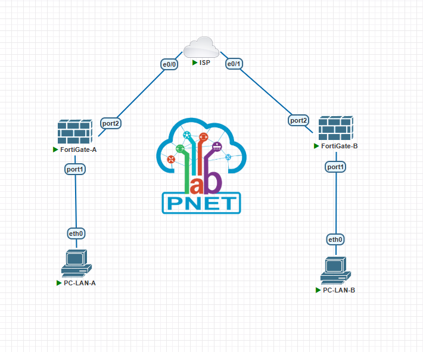
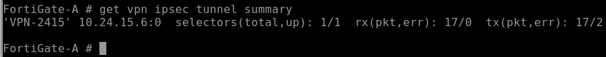
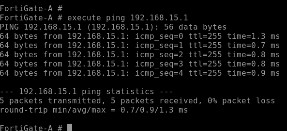
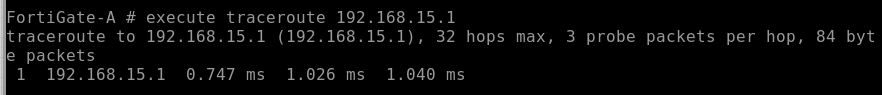

# VPN Site-to-Site Fortigate

**Estudiante:** Edwin De Paula  
**Matricula:** 2024-2415  
**Institución:** Instituto Tecnológico de las Américas (ITLA)  
**Asignatura:** Seguridad en Redes

---

## Video

| Recurso | URL |
|---|---|
| Video YouTube | https://youtu.be/_1o8ran630I |

---

## Objetivo

Implementar una VPN Site-to-Site entre dos firewalls FortiGate a través de un router ISP, estableciendo un túnel IPSec cifrado que permita la comunicación segura entre las redes LAN de ambos sitios, y verificar la conectividad mediante traceroute.

---

## Topología



| Dispositivo | Interfaz | Dirección IP | Descripción |
|---|---|---|---|
| FortiGate-A | port2 | 10.24.15.1/30 | WAN hacia ISP |
| FortiGate-A | port1 | 192.168.24.1/24 | LAN Site A |
| ISP | Ethernet0/0 | 10.24.15.2/30 | WAN hacia FortiGate-A |
| ISP | Ethernet0/1 | 10.24.15.5/30 | WAN hacia FortiGate-B |
| FortiGate-B | port2 | 10.24.15.6/30 | WAN hacia ISP |
| FortiGate-B | port1 | 192.168.15.1/24 | LAN Site B |
| PC-LAN-A | eth0 | 192.168.24.10/24 | Gateway: 192.168.24.1 |
| PC-LAN-B | eth0 | 192.168.15.10/24 | Gateway: 192.168.15.1 |

---

## Parámetros de Configuración

### Fase 1 - IPSec

| Parámetro | Valor |
|---|---|
| Nombre | VPN-2415 |
| Interfaz WAN | port2 |
| Propuesta | des-sha256 |
| Grupo Diffie-Hellman | 14 (2048 bits) |
| Remote Gateway A | 10.24.15.6 |
| Remote Gateway B | 10.24.15.1 |
| Pre-shared Key | Edwin2024 |

### Fase 2 - IPSec

| Parámetro | Valor |
|---|---|
| Nombre | VPN-2415-P2 |
| Propuesta | des-sha256 |
| Grupo Diffie-Hellman | 14 |
| Subred origen A | 192.168.24.0/24 |
| Subred destino A | 192.168.15.0/24 |
| Subred origen B | 192.168.15.0/24 |
| Subred destino B | 192.168.24.0/24 |

### Rutas Estáticas

| Dispositivo | Destino | Interfaz |
|---|---|---|
| FortiGate-A | 0.0.0.0/0 via 10.24.15.2 | port2 |
| FortiGate-A | 192.168.15.0/24 | VPN-2415 |
| FortiGate-B | 0.0.0.0/0 via 10.24.15.5 | port2 |
| FortiGate-B | 192.168.24.0/24 | VPN-2415 |

### Políticas de Firewall

| Política | Origen | Destino | Acción |
|---|---|---|---|
| LAN-to-VPN | port1 | VPN-2415 | Accept |
| VPN-to-LAN | VPN-2415 | port1 | Accept |

---

## Explicación de la Configuración

### VPN Site-to-Site en FortiGate

FortiGate implementa VPN IPSec usando interfaces virtuales de túnel. La Fase 1 define los parámetros de negociación IKE entre los dos peers, y la Fase 2 define qué tráfico se cifra (selectores de tráfico) y con qué algoritmos.

A diferencia de Cisco donde se usa un crypto map aplicado a una interfaz física, en FortiGate la VPN crea automáticamente una interfaz virtual que se puede usar en políticas de firewall y rutas estáticas como cualquier otra interfaz.

### Políticas de Firewall

Las políticas de firewall en FortiGate son obligatorias para permitir el tráfico — sin ellas, aunque el túnel esté establecido, el tráfico no fluirá. Se necesitan dos políticas simétricas: una para el tráfico saliente de la LAN hacia el túnel, y otra para el tráfico entrante del túnel hacia la LAN.

### Flujo de Negociación

1. FortiGate-A inicia negociación IKE Fase 1 hacia 10.24.15.6
2. Se negocia el canal ISAKMP con des-sha256 y grupo 14
3. Se establece la SA de Fase 2 con los selectores de subred
4. El tráfico de 192.168.24.0/24 hacia 192.168.15.0/24 fluye cifrado por el túnel
5. Las políticas de firewall permiten el tráfico en ambas direcciones

---

## Verificación

### Estado del Túnel

```
get vpn ipsec tunnel summary
```



El campo `selectors(total,up): 1/1` confirma que el túnel está activo y negociado correctamente.

### Ping entre LANs

```
execute ping-options source 192.168.24.1
execute ping 192.168.15.1
```



100% de success rate confirma la comunicación cifrada entre las redes LAN de ambos sitios.

### Traceroute entre LANs

```
execute traceroute-options source 192.168.24.1
execute traceroute 192.168.15.1
```



El traceroute muestra un único salto directo hacia FortiGate-B, confirmando que el tráfico viaja a través del túnel VPN sin pasar por el ISP como hop visible.

---

## Archivos del Repositorio

```
fortigate-site-to-site/
├── configs/
│   ├── FortiGate-A.txt
│   ├── FortiGate-B.txt
│   └── ISP.txt
├── docs/
│   └── screenshots/
│       ├── topology.png
│       ├── tunnel-summary.png
│       ├── ping-test.png
│       └── traceroute.png
└── README.md
```

---

## Herramientas Utilizadas

- PNetLab — Plataforma de emulación de red
- FortiGate VM64 KVM v6.46 build1879 — Firewall Fortinet
- Cisco IOSv 15.4(2)T4 — Router ISP
- VMware — Virtualización del servidor PNetLab
